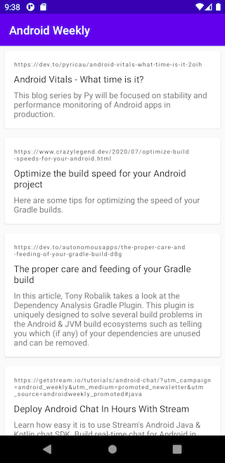
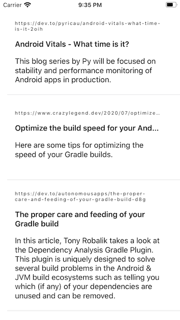

# Talan
Kotlin Multiplatform experimental project using [Kaskade](https://github.com/gumil/kaskade)

## Backend
Serverless function that maps Android Weekly rss into json using Kotless.

## Common SharedClient
Common code that compiles to iOS and JVM.
 - Kaskade
 - Ktor
 - Kotlinx.serialization
 - Kotlin Coroutines Flow
 
 ## Android
 - Jetpack Compose
 - Acorn 
 
 ## iOS
  - SwiftUI
  
 ## Screenshots
  